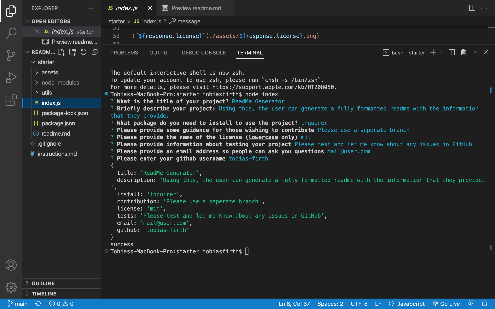
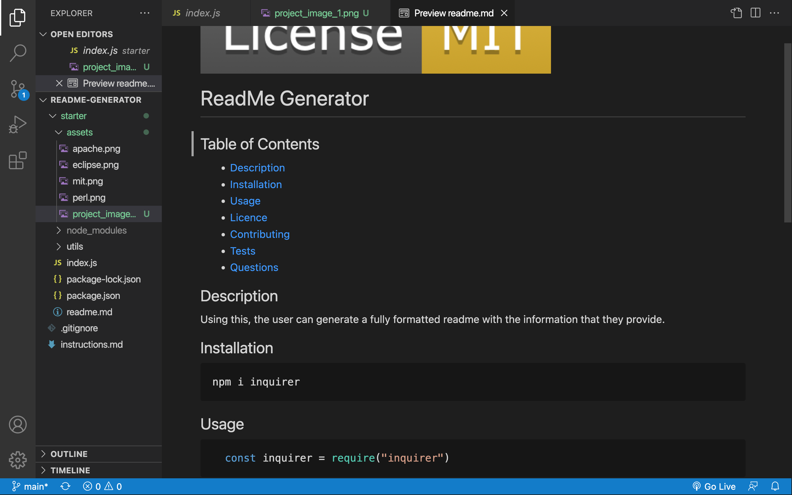

# readme-generator

## Description

This readme generator allows a user to eneter key information abouth their project, and generate a readme with formattted headings and the information that is required in a readme. This requires node to be installed. 

## Instructions

A couple of packages will be needed for the program to run. Install the following programs

~~~ javascript
npm i inqurier
~~~

~~~ javascript
npm i fs
~~~

Then, open the integrated terminal, and open node:
~~~ javascript
node index
~~~

At this stage, follow the prompts on screen, pressing the enter key once your response is complete. 

When "Success" is in the console, the reaeMe is ready. Open the markdown file and view. 

## Sample Images

